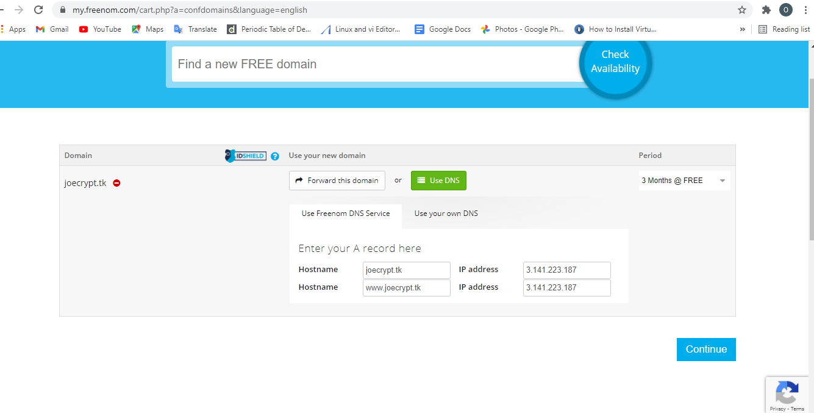

# Install Nginx Load Balancer
* Install Nginx and configure  
   $ sudo apt update  
   $ sudo apt install nginx  
\# open TCP port 80 and TCP port 443  
  
\# configure webservers IP address to domain name mapping  
  
\# Configure Nginx LB using Web Servers’ names defined in /etc/hosts  
$ sudo nano /etc/nginx/nginx.conf  
  
\# Restart Nginx and make sure the service is up and running  
$ sudo systemctl restart nginx  
  
*  Register a new domain name and configure secured connection using SSL/TLS certificates  
1. Register a new domain name with a domain name registrar \(freenom.com) in any domain zone  
  
1. Assign an Elastic IP to Nginx LB server and associate new domain name with this Elastic IP  
\# Create an elastic IP  
  
\# Assign elastic IP to nginx EC2 server  
  
\# Register a domain name on a registra  
  
\# Associate domain name with elastic IP  
  
review and update details  
  
\# Check webserver on browser using domain name in http protocol  
http://joecrypt.tk  
  
1. Configure nginx to recognise domain name  
Update nginx.conf file  
  
1. Install certbot and request for an SSL/TLS certificate  
\# Make sure snapd service is active and running  
$   sudo systemctl status snapd
  
\# Install certbot  
$ sudo snap install --classic certbot  
  
\# request certificate  
$ sudo ln -s /snap/bin/certbot /usr/bin/certbot  
$ sudo certbot --nginx  
  
\# test on browser  
  

1. Set up periodical renewal of your SSL/TLS certificate  
\# testing renewal command in dry-run mode  
$ sudo certbot renew --dry-run  
  
\#  configure a cronjob to run the command twice a day  
$ crontab -e  
  